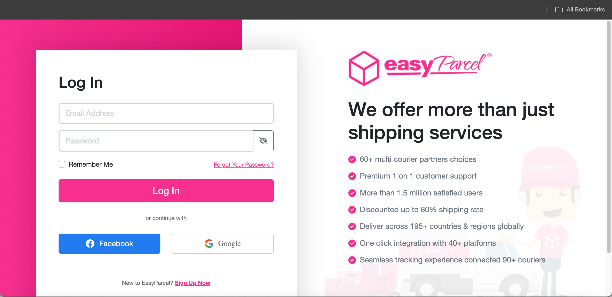
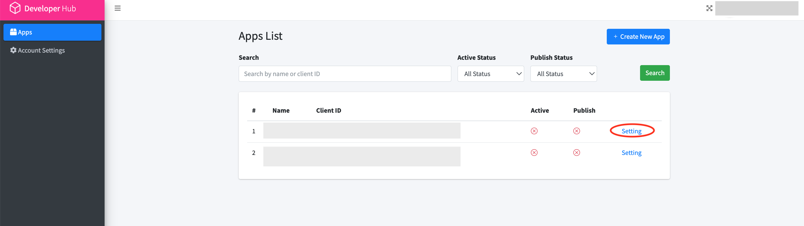
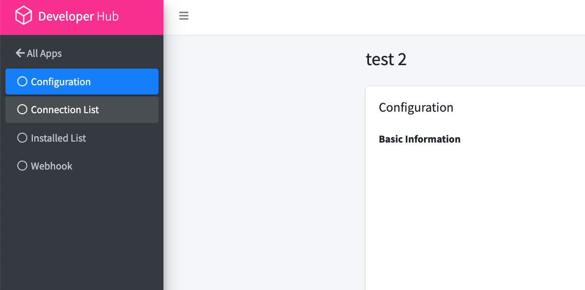
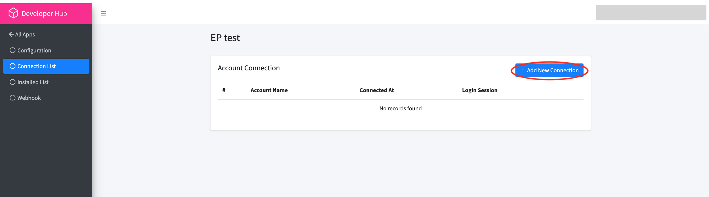
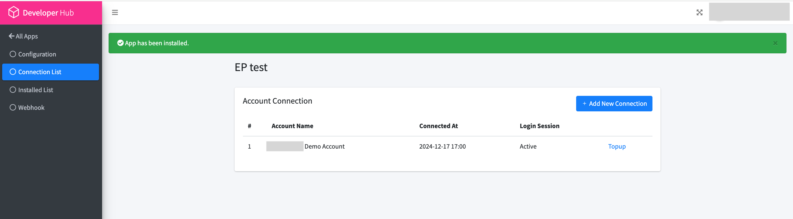
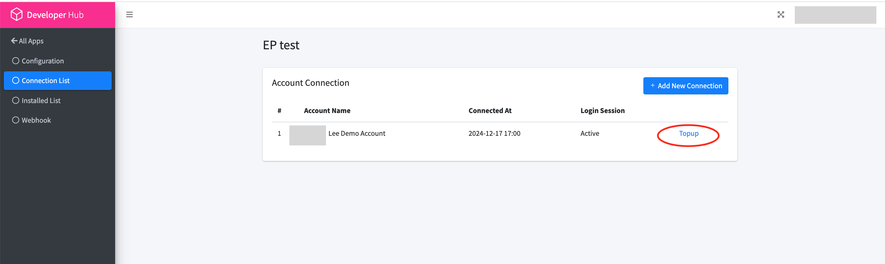
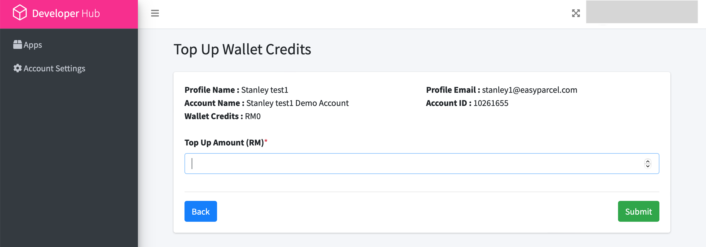
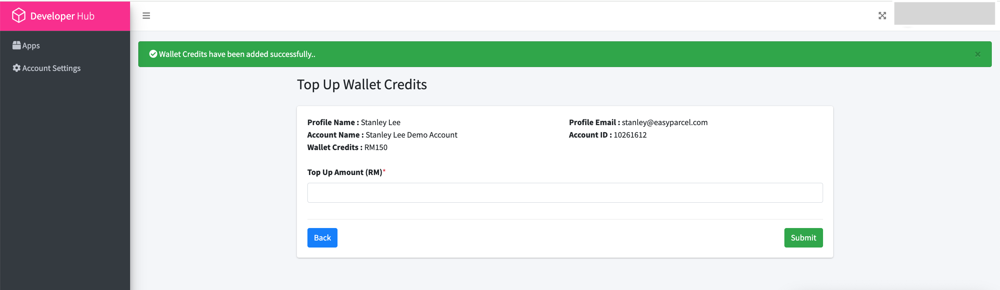

## Demo Account Setup Guide  | [Top Up Instructions →](#top-up-demo-account)

#### [← Back to Documentation](../README.md) | [Get Started with API →](1.get_started_with_easy_parcel_open_API.md)

---

### Prerequisites
- Existing EasyParcel developer account
- Completed API application registration
- Client ID credentials

---

### Step-by-Step Demo Account Setup

#### 1. Access Developer Portal
**URL:** [https://developer.easyparcel.com](https://developer.easyparcel.com)  

---

#### 2. Select Application
**Action:** Choose your registered application from the dashboard  

---

#### 3. Navigate to Connections
**Location:** Settings → Connection Management  

---

#### 4. Add New Connection
**Required:**  
✅ Sandbox environment selection  
✅ Connection name  

---

#### 5. Verify Successful Setup
**Confirmation:** Look for active status indicator  

---

### 💳 Top Up Demo Account

#### 1. Access Connection List
**Navigation:** Application Settings → Connection List  

---

#### 2. Initiate Top Up
**Note:** Use test credits (no real money required)  

---

#### 3. Confirm Transaction
**Success Indicators:**  
✅ Balance update confirmation  
✅ Transaction ID generated  

---

#### 4. Proceed to API Integration
**Next Step:** [Begin API Implementation →](../1.Guides/1.get_started_with_easy_parcel_open_API.md)

---

### Navigation

