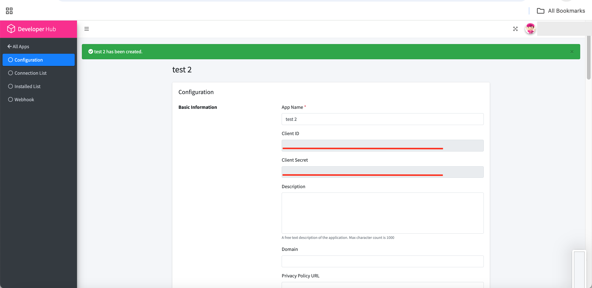

4.)Get the client id
Get Client ID to pass to the Oauth URL

5.)Follow [the Steps to get Oauth access token](get_oauth_access_token.md)

6.)Call the API with the [Oauth](../oauth_authentication.md) access token

