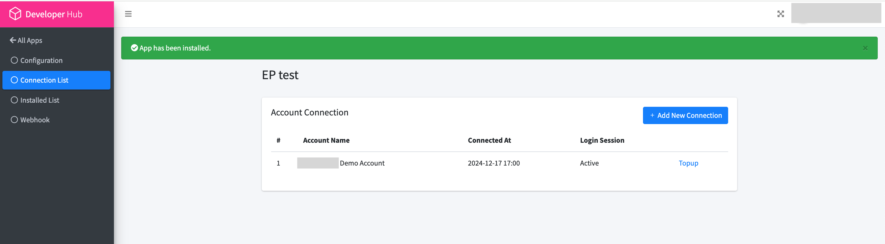

## Setup demo account  | [Top up demo account](#Top-up-demo-account)

#### [Get started with API](1.get_started_with_easy_pracel_open_API.md) | [Back to official documentation](../README.md)

#### Steps to setup demo account

2.)Select Application and select settings of the application desire

3.)Select Connection list

4.)Add connection list

5.)Demo account created

