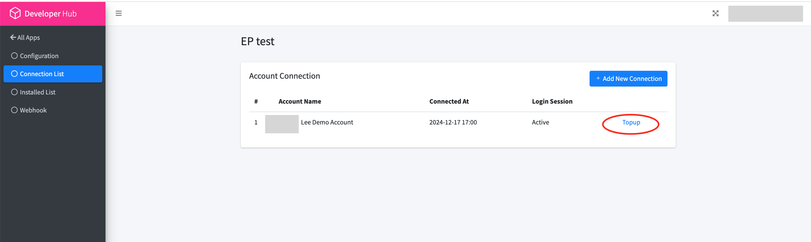
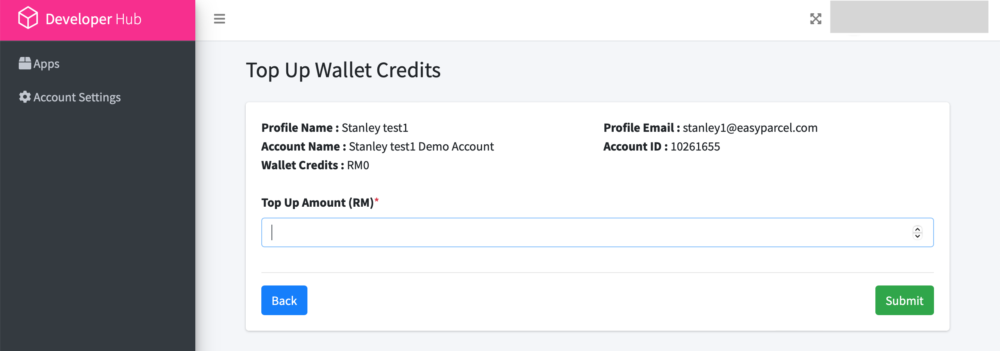
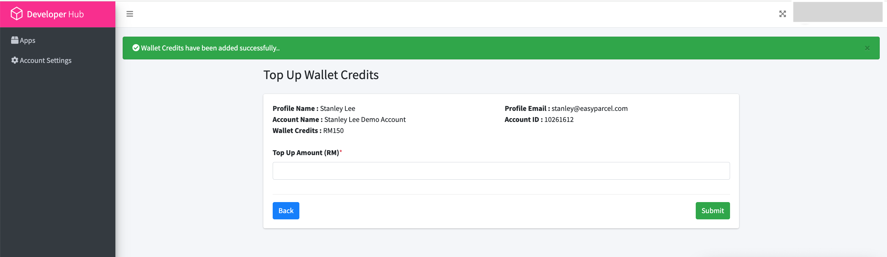

### Top up demo account
1.) in the Application settings, connection list, select top up

2.) Top up the amount desire.

3.)Top up successful

4.) Continue with [EASY PARCEL API SETUP](get_started_with_easy_parcel_open_API.md)
