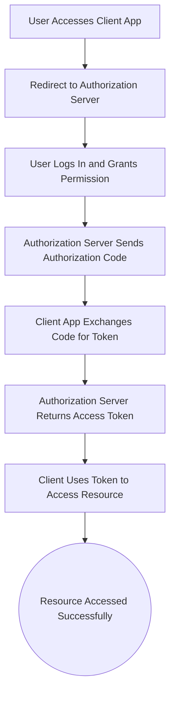

## Oauth Authentication


EasyParcel's API uses the OAuth 2.0 authorization framework to ensure secure access to its services. OAuth 2.0 allows applications to authenticate and access the API on behalf of a user without directly exposing user credentials. 

- **OAuth Version**: OAuth 2.0
- **Grant Types Supported**: Authorization Code, Client Credentials

OAuth (Open Authorization) is an open standard protocol that allows secure authorization in a simple and standardized way from web, mobile, and desktop applications. EasyParcel uses OAuth to enable applications to securely access resources on behalf of the user without exposing the user's credentials.

OAuth involves three main components:
1. **Client**: The application requesting access to the user's resources.
2. **Resource Server**: The server hosting the protected resources.
3. **Authorization Server**: The server responsible for authenticating the user and issuing access tokens.

The OAuth 2.0 authorization flow consists of the following steps:
1. **Client Requests Authorization**: The client directs the resource owner to the authorization server to request authorization.
2. **Authorization Server Requests Login**: The authorization server prompts the resource owner to log into their EasyParcel account.
3. **User Logs In and Authenticates**: The resource owner logs into their EasyParcel account on the authorization server.
4. **Authorization Server Requests Consent**: The authorization server asks the resource owner for consent to grant access to the client.
5. **Authorization Grant**: The authorization server redirects the resource owner back to the client with an authorization grant.
6. **Client Requests Access Token**: The client requests an access token from the authorization server using the authorization grant.
7. **Authorization Server Issues Token**: The authorization server issues an access token to the client.
8. **Client Accesses Resource**: The client uses the access token to access the resource server on behalf of the resource owner.

## Security Considerations
Ensure to use HTTPS to protect communication between clients and servers to prevent eavesdropping and man-in-the-middle attacks.

### 🔐 OAuth 2.0 Authorization Flow




### Authorization Endpoint
The Authorization Endpoint is used by the client to obtain authorization from the resource owner via user-agent redirection.
#### Endpoint URL: 
```
https://developer.easyparcel.com/ep_auth/login
```


### Token Endpoint
The Token Endpoint is used by the client to obtain an access token by presenting its authorization grant.
#### Endpoint URL: 
```
https://developer.easyparcel.com/ep_auth/token
```

<div align="center" style="margin: 1.5rem 0;">

[](../README.md)
[](../2.Create%20Sandbox/1.Setup%20Demo%20Account.md)
[](..//3.OAuth%20Authentication/1.%20oauth%20authentication%20guide.md)
[](../4.Postman%20Collection/README.md)
[](/4.Postman%20Collection/README.md)

</div>
