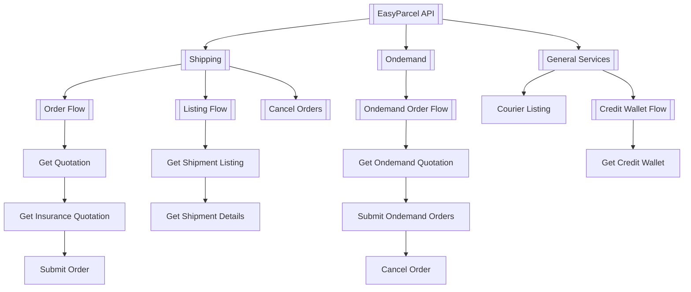

### **API Functions & Features**

The EasyParcel API offers various functionalities grouped under different categories. Below is an overview of the key features:

#### **Standard Shipping**:
- [Get Shipment Quotation](Features/Shipping/1.get_shipment_quotation.md)
- [Get Insurance Quotation](Features/Shipping/2.get_insurance_quotation.md)
- [Get Courier Dropoff Point](Features/Shipping/3.get_courier_dropoff_point.md)
- [Submit Shipment Orders](Features/Shipping/4.submit_shipment_orders.md)

#### **OnDemand Shipping**:
- [Get OnDemand Quotation](Features/OnDemand/1.get_ondemand_quotation.md)
- [Submit OnDemand Order](Features/OnDemand/2.submit_ondemand_order.md)

#### **Get Wallet**:
- [Get Wallet Balance](Features/get_wallet.md)

#### **Get Courier List**:
- [Get Wallet Balance](Features/get_courier_list.md)

---

# EasyParcel API Flow Overview

This document provides a visual representation of the different flows and processes available through the EasyParcel API.

## API Workflow Diagram

### **Order Function Flow**

Here’s a visual representation of the order function flow in the EasyParcel API:

  

---

### [Shipping](Shipping)

- Scheduled Delivery

- Cost-effective

- Tracking Available
  
[Get Shipment Quotation](Shipping/1.get_shipment_quotation.md)

[Get Insurance Quotation](Shipping/2.get_insurance_quotation.md)

[Get Courier Dropoff point](Shipping/3.get_courier_dropoff_point.md)

[Submit Shipment Orders](Shipping/4.submit_shipment_orders.md)

### [OnDemand](OnDemand)

- Speed: providing same-day delivery.

- Real-Time Tracking: You can track your parcel in real-time once the booking is made.

- Flexibility: You can choose your preferred vehicle and schedule the pick-up time.

- Cost-Efficiency: You only pay for the services you need.

- Priority Handling: Parcels are prioritized, ensuring faster delivery compared to standard methods.

[Get OnDemand Quotation](OnDemand/1.get_ondemand_quotation.md)

[Submit OnDemand Order](OnDemand/2.submit_ondemand_order.md)

### Wallet

[Get Wallet](get_Wallet.md)
