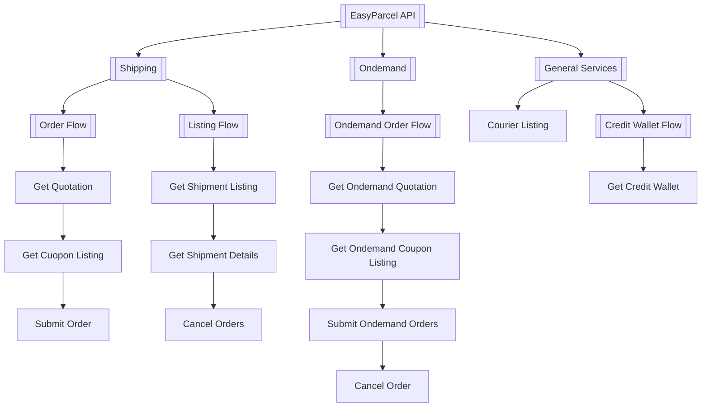

### **API Functions & Features**

The EasyParcel API offers various functionalities grouped under different categories. Below is an overview of the key features:

#### **Standard Shipping**:
- Scheduled Delivery

- Cost-effective

- Tracking Available

- Suitable for high volume shipment

#### **OnDemand Shipping**:

- Speed: providing same-day delivery.

- Real-Time Tracking: You can track your parcel in real-time once the booking is made.

- Flexibility: You can choose your preferred vehicle and schedule the pick-up time.

- Cost-Efficiency: You only pay for the services you need.

- Priority Handling: Parcels are prioritized, ensuring faster delivery compared to standard methods.

#### **Wallet**:
- All submission will be deducting from credit waller

#### **Get Courier List**:
- Getting all the courier listing available for a country

#### **Get Coupon List**:
- Getting coupon available for the order for both standard shipping and ondemand

---

# EasyParcel API Flow Overview

This document provides a visual representation of the different flows and processes available through the EasyParcel API.

## API Workflow Diagram

---

### [Standard](Shipping)
  
[Get Shipment Quotation](../5.API%20endpoint/%201.Shipping/1.Get%20Shipment%20Quotation.md)

[Coupon Listing](../5.API%20endpoint/%201.Shipping/2.Get%20Coupon%20List.md)

[Submit Shipment Order](../5.API%20endpoint/%201.Shipping/3.Submit%20Orders.md)

[Get Shipment Listing](../5.API%20endpoint/%201.Shipping/4.Get%20Shipment%20Listing.md)

[Get Shipment Details](../5.API%20endpoint/%201.Shipping/6.Get%20Shipment%20details.md)

[Cancel Order](../5.API%20endpoint/%201.Shipping/5.Cancel%20Shipment.md)

### [OnDemand](OnDemand)

[Get OnDemand Quotation](../5.API%20endpoint/%202.Ondemand/1.Get%20Ondemand%20Quotation.md)

[Coupon Listing](../5.API%20endpoint/%202.Ondemand/2.Get%20Ondemand%20Coupon%20List.md)

[Submit OnDemand Order](../5.API%20endpoint/%202.Ondemand/4.Submit%20Ondemand%20Order.md)

[Cancel OnDemand Order](../5.API%20endpoint/%202.Ondemand/3.Cancel%20Ondemand.md)

### Wallet

[Get Wallet](3.Get%20Credit%20Wallet.md)

### Courier List
[Courier Listing](4.Courier%20listing.md)

