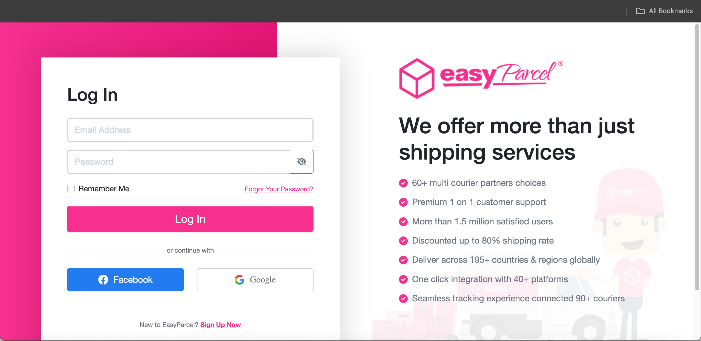
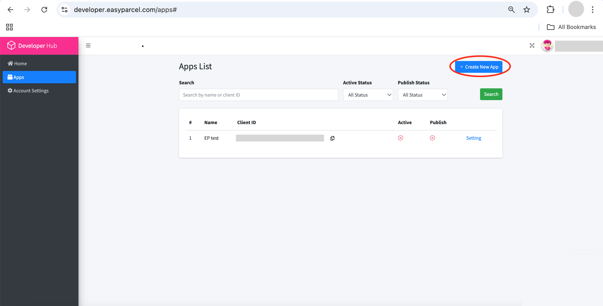
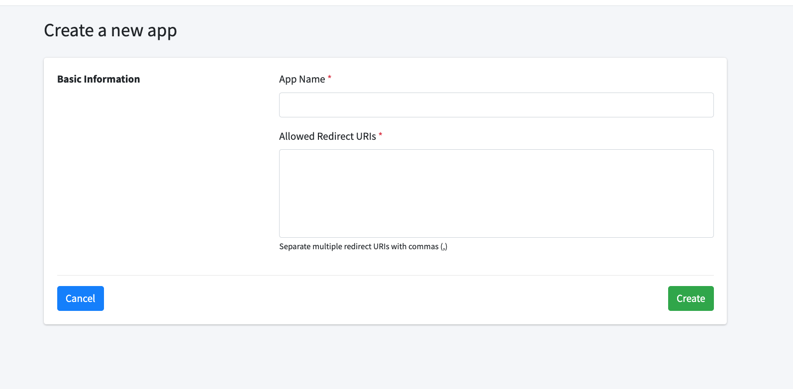

## Get Started with EasyParcel Open API

#### [← Back to Documentation](../README.md) | [Setup Demo Account →](2.Setup_demo_account.md)

---

### Step-by-Step Integration Guide

#### 1. Register Developer Account
**Action:** Visit [EasyParcel Developers Hub](https://developer.easyparcel.com/)  
**Purpose:** Create your developer account to access API features

---

#### 2. Create New Application
**What you'll need:**  
- Platform URL  
- Application name  

---

#### 3. Configure Application Settings
**Required fields:**  
✅ Application Name  
✅ Redirect URLs  

---

#### 4. Obtain Client ID
**Important:** Store this securely - you'll need it for OAuth authentication

---

#### 5. Get OAuth Access Token
**Next Step:** [Follow our detailed OAuth guide](../Guides/3.get_oauth_access_token.md)  
**Includes:** Code samples and troubleshooting tips

---

#### 6. Make Your First API Call
**Implementation Guide:** [OAuth Authentication Documentation](../oauth_authentication.md)  
**Recommended:** Start with sandbox endpoints first

---

### Navigation

 

