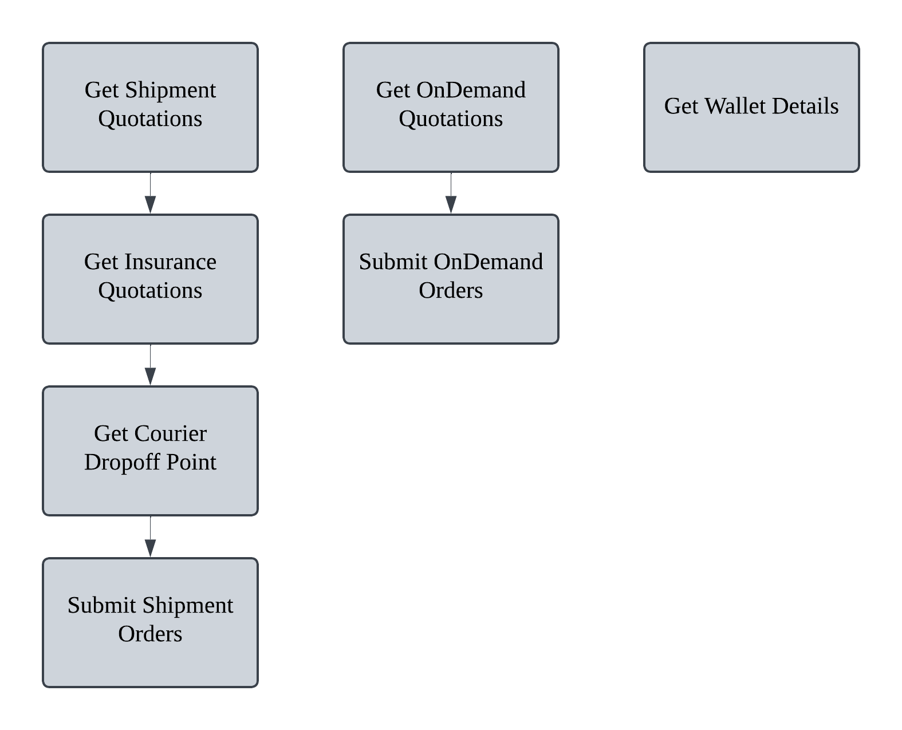

  

# EasyParcel API Documentation

Welcome to the EasyParcel API. This guide will help you integrate with EasyParcel, providing access to shipping functionalities through a RESTful API interface.

---

## **Table of Contents**
- [Overview](#overview)
- [Guides](#guides)
- [OAuth Authentication](#oauth-authentication)
- [API Features](#api-functions-features)
- [Order Flow](#order-function-flow)
- [References](#references)

---

### **Overview**

The EasyParcel API provides access to a range of shipping operations. Through the API, you can manage shipments, quotations, tracking, and more. It follows the RESTful architecture and supports integration with multiple platforms.

---

### **Guides**

To get started with EasyParcel API, follow the guides below:

- [Getting Started with EasyParcel API](Guides/1.get_started_with_easy_pracel_open_API.md)
- [Setup Demo Account](Guides/2.setup_demo_account.md)

---

### **OAuth Authentication**

EasyParcel uses OAuth 2.0 for secure authentication and to allow controlled access to its services.

- [Learn more about OAuth Authentication](oauth_authentication.md)
- [Steps to get OAuth Access Token](Guides/3.get_oauth_access_token.md)

---

### **API Functions & Features**

The EasyParcel API offers various functionalities grouped under different categories. Below is an overview of the key features:

#### **Standard Features**:
- [Get Shipment Quotation](Features/Shipping/1.get_shipment_quotation.md)
- [Get Insurance Quotation](Features/Shipping/2.get_insurance_quotation.md)
- [Get Courier Dropoff Point](Features/Shipping/3.get_courier_dropoff_point.md)
- [Submit Shipment Orders](Features/Shipping/4.submit_shipment_orders.md)

#### **OnDemand Features**:
- [Get OnDemand Quotation](Features/OnDemand/1.get_ondemand_quotation.md)
- [Submit OnDemand Order](Features/OnDemand/2.submit_ondemand_order.md)

#### **Wallet Features**:
- [Get Wallet Balance](Features/get_wallet.md)

---

### **Order Function Flow**

Here’s a visual representation of the order function flow in the EasyParcel API:

  

---

### **References**

For further details, refer to the following documents:

- [API Return Status](References/API_return_status.md)
- [Country Codes](References/country_code.md)
- [ISO 3166](References/ISO_3166.md)
