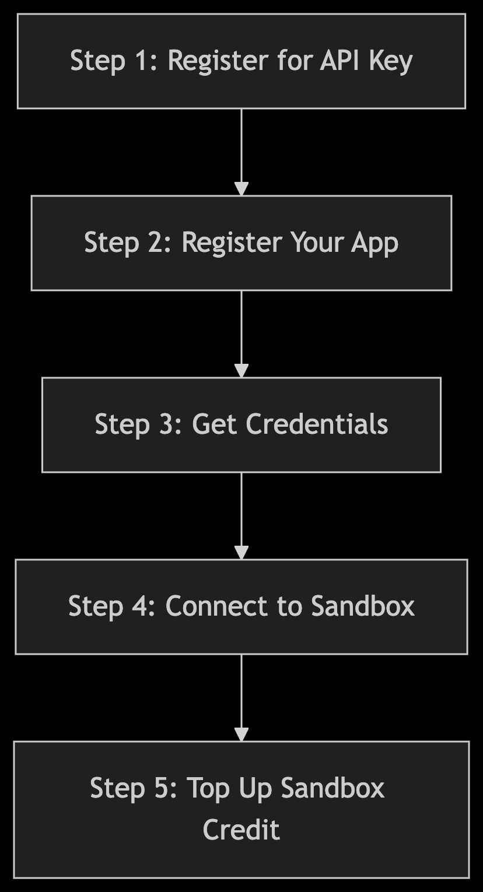
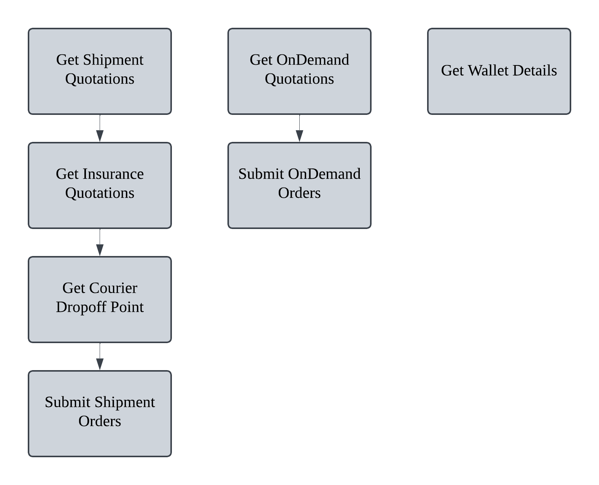

  

# EasyParcel API Documentation

Welcome to the **EasyParcel API Documentation**! This guide will help you integrate with EasyParcel and get access to shipping functionalities via a RESTful API interface. 

---

## **Table of Contents**

- [Overview](#overview)
- [Setup Flow](#setup-flow)
- [Order Function Flow](#order-function-flow)
- [Getting Started](#getting-started)
- [OAuth Authentication](#oauth-authentication)
- [API Features & Functions](#api-functions--features)
- [References](#references)

---

## **Overview**

The **EasyParcel API** enables you to manage shipping, obtain quotations, track shipments, and much more. It's designed using a RESTful architecture, offering a seamless integration with various e-commerce platforms and third-party applications.

### **Key Benefits**:
- **Rate Calculation**: Get live rates from various couriers.
- **Order Management**: Create, update, and manage shipments.
- **Tracking**: Real-time tracking updates for shipments.
- **Effortless APP Integrate**: Easy integration with your online store or application.

---
## **Setup Flow**

Below is a visual guide to set up flow:

  

---
## **Order Function Flow**

Below is a visual guide to the order processing flow in the EasyParcel API:

  

---

## **Getting Started**

To begin using the EasyParcel API, follow the steps below to set up your environment:

- [Getting Started with EasyParcel API](2.Integration/get_started_with_easy_parcel_open_API.md)
- [Setting Up a Demo Account](2.Integration/setup_demo_account.md)

Once set up, you can use the provided **Sandbox** environment to test the API without impacting live data.

---

## **OAuth Authentication**

EasyParcel uses **OAuth 2.0** for secure authentication, enabling controlled access to the system.

1. **OAuth 2.0 Overview**:
    - OAuth 2.0 is a standard authorization framework allowing third-party applications to access your EasyParcel resources without exposing sensitive credentials.
  
2. **Steps to Obtain OAuth Token**:
    - [Learn about OAuth Authentication](oauth_authentication.md)
    - [Getting OAuth Access Token](Guides/3.get_oauth_access_token.md)

---
## **API Functions & Features**

The EasyParcel API offers a wide array of functionalities divided into categories. Below are the key features available:

### **Standard Features**:
- **Get Shipment Quotation**  
  Get a detailed quote for your shipment, including rates, delivery times, and courier options.  
  [Read more](Features/Shipping/1.get_shipment_quotation.md)

- **Get Insurance Quotation**  
  Obtain a quote for shipment insurance based on your shipment details.  
  [Read more](Features/Shipping/2.get_insurance_quotation.md)

- **Get Courier Dropoff Point**  
  Fetch available dropoff points for various couriers.  
  [Read more](Features/Shipping/3.get_courier_dropoff_point.md)

- **Submit Shipment Orders**  
  Create and submit shipment orders for processing.  
  [Read more](Features/Shipping/4.submit_shipment_orders.md)

### **OnDemand Features**:
- **Get OnDemand Quotation**  
  Get an on-demand quotation based on specific criteria.  
  [Read more](Features/OnDemand/1.get_ondemand_quotation.md)

- **Submit OnDemand Order**  
  Create an on-demand shipment order.  
  [Read more](Features/OnDemand/2.submit_ondemand_order.md)

### **Wallet Features**:
- **Get Wallet Balance**  
  Check your current wallet balance for API transactions.  
  [Read more](Features/get_wallet.md)

---
## **References**

For additional details, please refer to the following resources:

- [API Return Status](References/API_return_status.md)  
  Learn about the different return statuses you may encounter while using the EasyParcel API.
  
- [Country Codes](References/country_code.md)  
  Get the list of country codes supported by the EasyParcel API.

- [ISO 3166 Country Codes](References/ISO_3166.md)  
  A full list of country codes defined by the ISO 3166 standard.
---
## **Contact Us**

If you have any questions or need further support with the EasyParcel API, our team is available for assistance. You can reach out to us via the following channels:
- **WhatsApp Support**: For quick support, chat with our team directly on WhatsApp. Click [here](https://wa.me/6042023160) to start a conversation.

We’re here to help you integrate and make the most out of EasyParcel’s services!

### **Important Notes**
- **API Rate Charges**: EasyParcel wont charges credit when you test the quotation.
- **Sandbox Environment**: Test it in the sandbox environment before going live to ensure everything works correctly.

---

