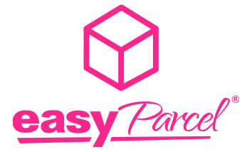
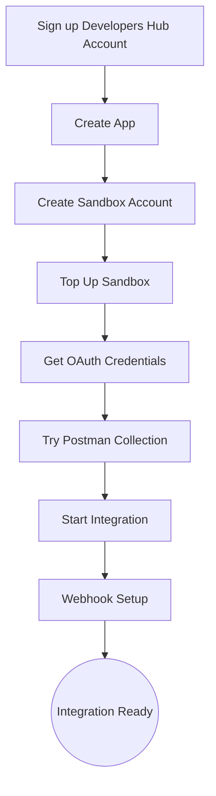

  

# EasyParcel API Documentation

Welcome to the **EasyParcel API Documentation**! This guide will help you integrate with EasyParcel and get access to shipping functionalities via a RESTful API interface. 

---

## **Setup Flow**

Below is a visual guide to set up flow:

```mermaid
flowchart TD
    A[Sign up Developers Hub Account] --> B[Create App]
    B --> C[Create Sandbox Account]
    C --> D[Top Up Sandbox]
    D --> E[Get OAuth Credentials]
    E --> F[Try Postman Collection]
    F --> G[Start Integration]
    G --> H[Webhook Setup]
    H --> I((Integration Ready))
```
---

## Shipping Services

### Order Flow

The standard process for creating and managing shipping orders:

1. **Get Quotation** - Retrieve shipping rates for various couriers based on origin, destination, and parcel details
2. **Get Insurance Quotation** - Optional step to get insurance rates for valuable shipments
3. **Submit Order** - Create a shipment order with the selected courier service

### Listing Flow

Access and manage existing shipments:

1. **Get Shipment Listing** - Retrieve a list of shipments with optional filtering
2. **Get Shipment Details** - Access comprehensive information about a specific shipment

### Cancel Orders

Cancel one or more existing shipment orders when needed.

## Ondemand Services

### Ondemand Order Flow

For immediate pickup and delivery services:

1. **Get Ondemand Quotation** - Retrieve pricing for immediate delivery services
2. **Submit Ondemand Orders** - Create an on-demand delivery order
3. **Cancel Order** - Cancel an on-demand delivery when needed

## Common API Flow Patterns

### Standard Shipping Flow

1. Get shipping quotation for your parcel
2. Optionally get insurance quotation for valuable items
3. Submit shipping order with your selected service
4. Check shipment status via Shipment Listing or Details endpoints
5. Optionally cancel the shipment if needed

### Ondemand Delivery Flow

1. Get ondemand quotation for immediate delivery
2. Submit ondemand order with your selected service
3. Track the delivery status
4. Optionally cancel if needed

## Best Practices

1. **Always check your wallet balance** before submitting orders to ensure sufficient funds
2. Use the **Shipment Listing** endpoint with filters to efficiently manage large volumes of shipments
3. Include **complete and accurate information** in all requests to avoid processing delays
4. Implement proper **error handling** for all API responses
5. Use the **Courier Listing** endpoint to get the most current list of available services

## Implementation Guide

For detailed information on implementing each endpoint, refer to the individual API documentation pages. Each endpoint has specific request and response formats that must be followed for successful integration.
