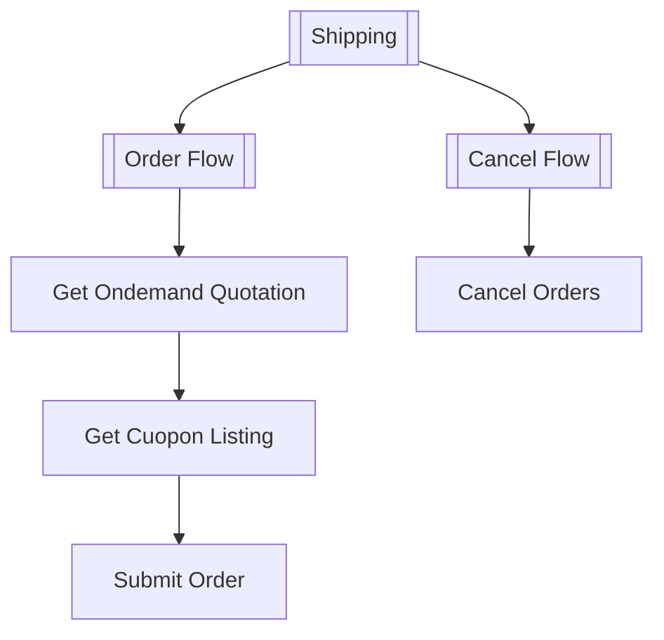

<h1 id=od-shipping-2025-06"> On-demand Shipping </h1>

<h2 id="od-API-flow-2025-06"> Ondemand API Flow Overview</h2>

This document provides a visual representation of the different flows and processes available through the EasyParcel API.

### Ondemand Workflow Diagram

